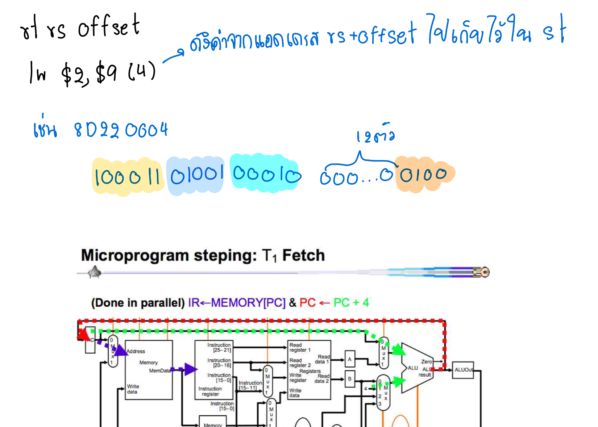

# รางานวิชา สถาปัตยกรรมคอมพิวเตอร์ [CN210]
## สรุปเนื้อหาที่เรียนในรายวิชา 
- ทุกคำสั่งมีขนาดเท่ากันคือ 32 บิต
- มีคำสั่ง 3 รูปเเบบ ได้แก่ R-Format, I-Format และJ-Format
op( opcode ) คือการบ่งบอกว่า ใช้คำสั่งรูปเเบบไหน  
### R - Format

    * โครงสร้าง | op  | rs | rt | rd  | shamt |func     
    * บิต  6,5,5,5,5,6  ตามลำดับ
  
    * ALU            func$rd,$rs,$st  

### I - Format
    * โครงสร้าง | op | rs | rt | value or offset  
    * บิต  6,5,5,16  ตามลำดับ
   
    * ALUi           alui $rt,$rs,value              
    
### J - format

    * โครงสร้าง | op | absolute address |
    * บิต 6,26 ตามลำดับ
   
     * Jump           j address
 
 

### อธิบาย CLIP  1 
     คลิปนี้ อธิบายการทำงานของ j-format 
     โดยการทำงานเริ่ม จากิฟไปทางขวา2 เเละตัด6บิทเเรกออก เปลี่ยนไปเป็น op ของjump 000010
[ **homework Clip-1**](https://www.youtube.com/watch?v=riAvroydGXE)
### อธิบาย CLIP  2
 
      คลิปนี้จะอธิบายการทำงานของ cpu เริ่มต้นเมื่อเปิดสวิซท์ ว่าจะเเปลงภาษาไบนารี่ เป็นภาษาเครื่องอย่างไร
[ **homework Clip-2**](https://www.youtube.com/watch?v=MS8ugNKOJ7U&t=27s)

### อธิบาย CLIP  3
 
     คลิปนี้อธิบายข้อเเตกเเต่งระหว่าง  Single Cycle กับ Multicycle 
 [ **homework Clip-3**](https://www.youtube.com/watch?v=7nbPBMxXHjQ&t=3s)

### อธิบาย CLIP  4
  
 
    ในคลิป พูดถึง การทำงานของ lw ซึงมี T1-T5
    T1 Fetch จะเป็นการส่งค่าให้ register และส่งค่าให้ ALU เพื่อ +4 
    T2Fetch+1 เพื่อเก็บค่า register 2 ตัว และส่งเข้าไปที่ ALUOut 
    T3ทำการ Mem1 เป็นการส่งค่าจาก Register ไปเข้า ALU เพื่อทำคำสั่งแล้วส่งให้ ALUOut 
    T4ส่งค่าที่เก็บใน AUOutไปให้memory จากนั้นmemoryจะส่งไปเก็บใน memory data register
    T5ส่งค่าที่เก็บใน memory register ไปไว้ใน register2
 
 [ **homework Clip-4**](https://www.youtube.com/watch?v=qNPi691dTtY&t=75s)
### อธิบาย CLIP  5
     
     ในคลิป 5 จะพูดถึงคำสั่ง beq in cycle ซึ่งมีทั้งหมด 3 step (T1-T3) 
     1 เมื่อทำการเปิด switch PC จะทำการอ่านคำสั่งในmemoryแล้วนำข้อมูลที่อ่านไปเก็บไว้ใน instruction register 
     T2 นำค่าที่เก็บอยู่ใน instruction register มาเก็บไว้ที่ A และB (registerl (rs) and register2 (rt) 
        ขณะเดียวกันนั้นก็นำค่าoffsetมาSign extend จาก 16> 32 บิตแล้วนำมาเก็บไว้ที่ ALU 
     T3 นำค่า register1 กับ register2 มาลบกันที่ALUแล้วถ้าเป็นูนย์คำสั่งก็จะไปทำงานที่addressนั้น (address ก็คือค่า offset)
     
 [ **homework Clip-5**](https://www.youtube.com/watch?v=s0cYBJ3tLiU)

### อธิบาย CLIP  6

     ในคลิป 6 จะพูดถึงคำสั่ง R-type ซึ่งมีทั้งหมด 4 cycle (TI-T4) 
     1 เมื่อทำการเปิด switch PC จะทำการอ่านคำสั่งในmemoryแล้วนำข้อมูลที่อ่านไปเก็บไว้ใน instruction register
       ในขณะเดียวกัน PC จะนำPCไปบวก4 ที่ ALU แล้วทำการเอา PC + 4 มาเก็บไว้แทนที่PCเดิม 
     2 นำค่าที่เก็บอยู่ใน instruction register มาเก็บไว้ที่ A และB (registerl (rs) and register2 (rt) "ไม่มีค่า offset เพราะว่าเราทำคำสั่ง R-tube 
     3 นำค่า register กับ register2 มาคำนวณกันที่ALUแล้วเอาผลลัพธ์ที่ได้มาเก็บใน ALUOut) T4 นำค่า ALUOut ไปเก็บไว้ใน register 2
 
[ **homework Clip-6**](https://www.youtube.com/watch?v=vzmKDfFe6nQ&t=32s)
### อธิบาย CLIP  7
    ในคลิป 7 จะพูดถึง Pipelining-ความแตกต่างระหว่าง Single Cycle, Multiple Cycle กับ Pipeline-ปัญหาที่พบใน Pipeline 
    1. Structural hazards: เมื่อ 2 คำสั่งทำงานพร้อมกันโดยเป็นอุปกรณ์ตัวเดียวกันแล้วเป็นวงจรเดียวกันจะเกิดการชนกัน 
    2. data hazards: ต้องการจะใช้ข้อมูลแต่ว่าข้อมูลนั้นยังไม่เสร็จ 
    3. control hazards: เงื่อนไขยังไม่เสร็จ
    -วิธีการแก้ปัญหาใน Pipeline
    1. waiting: ให้รอก่อน 
    2. Forwarding: โยนค่าข้ามไป 
    2. Load Forwarding: โยนค่าหลังไปไว้ในmemoryเเล้วข้ามไป 
    3. Recordering: เรียงคำสั่งใหม่
 [ **homework Clip-7**](https://www.youtube.com/watch?v=i0zpqcLBxGs)
    
