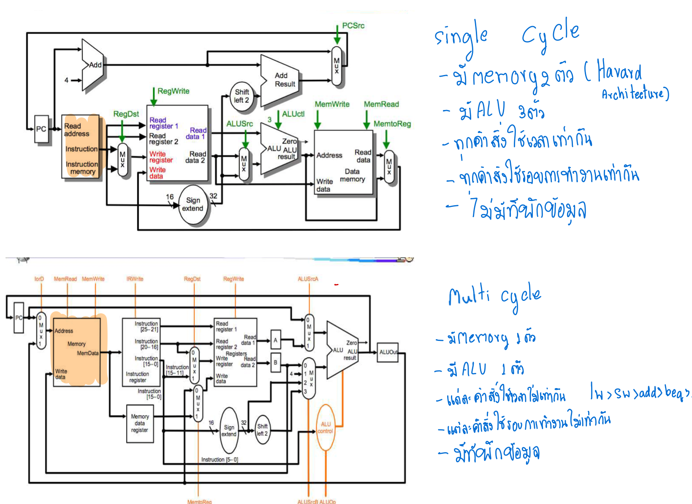

# รางานวิชา สถาปัตยกรรมคอมพิวเตอร์ [CN210]
## สรุปเนื้อหาที่เรียนในรายวิชา 
- ทุกคำสั่งมีขนาดเท่ากันคือ 32 บิต
- มีคำสั่ง 3 รูปเเบบ ได้แก่ R-Format, I-Format และJ-Format
op( opcode ) คือการบ่งบอกว่า ใช้คำสั่งรูปเเบบไหน  
### R - Format

    * โครงสร้าง | op  | rs | rt | rd  | shamt |func     
    * บิต  6,5,5,5,5,6  ตามลำดับ
  
    * ALU            func$rd,$rs,$st  

### I - Format
    * โครงสร้าง | op | rs | rt | value or offset  
    * บิต  6,5,5,16  ตามลำดับ
   
    * ALUi           alui $rt,$rs,value              
    
### J - format

    * โครงสร้าง | op | absolute address |
    * บิต 6,26 ตามลำดับ
   
     * Jump           j address
 
 

### อธิบาย CLIP  1 
     คลิปนี้ อธิบายการทำงานของ j-format 
     โดยการทำงานเริ่ม จากิฟไปทางขวา2 เเละตัด6บิทเเรกออก เปลี่ยนไปเป็น op ของjump 000010
[ **homework Clip-1**](https://www.youtube.com/watch?v=riAvroydGXE)
### อธิบาย CLIP  2
 
      คลิปนี้จะอธิบายการทำงานของ cpu เริ่มต้นเมื่อเปิดสวิซท์ ว่าจะเเปลงภาษาไบนารี่ เป็นภาษาเครื่องอย่างไร
[ **homework Clip-2**](https://www.youtube.com/watch?v=MS8ugNKOJ7U&t=27s)

### อธิบาย CLIP  3
 
     คลิปนี้อธิบายข้อเเตกเเต่งระหว่าง  Single Cycle กับ Multicycle 
 [ **homework Clip-3**](https://www.youtube.com/watch?v=7nbPBMxXHjQ&t=3s)

### อธิบาย CLIP  4
 
 [ **homework Clip-4**](https://www.youtube.com/watch?v=qNPi691dTtY&t=75s)
### อธิบาย CLIP  5
 
 [ **homework Clip-5**](https://www.youtube.com/watch?v=s0cYBJ3tLiU)

### อธิบาย CLIP  6
 
[ **homework Clip-6**](https://www.youtube.com/watch?v=vzmKDfFe6nQ&t=32s)
### อธิบาย CLIP  7
 
 [ **homework Clip-7**](https://www.youtube.com/watch?v=i0zpqcLBxGs)
    
